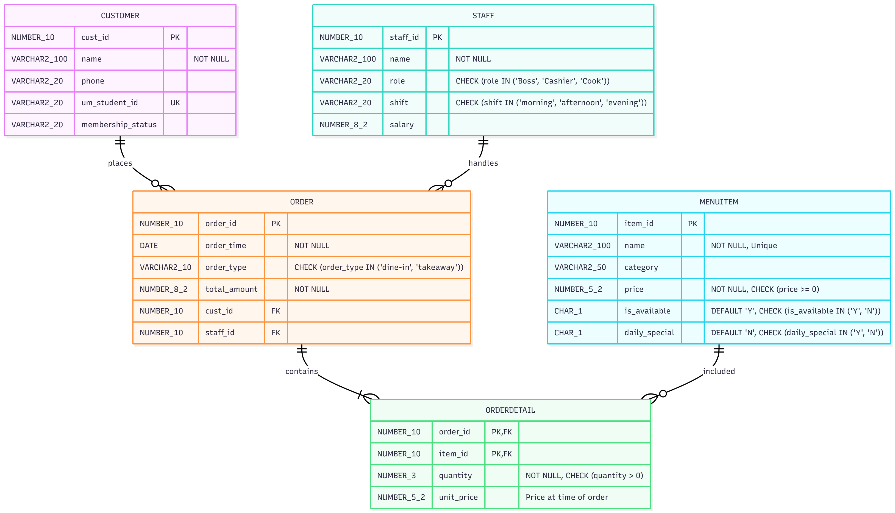

# Restaurant Operations Database System

An Oracle SQL database system for restaurant order processing, billing validation, inventory checks, and operational reporting.

## Why I Built This

Restaurant ordering systems need reliable data rules: staff should not be able to sell unavailable items, historical bills should not change when menu prices change later, and order totals should match the actual line items. This project models those business rules directly in the relational database rather than leaving all validation to application code.

## Features

- Normalized schema for customers, staff, menu items, orders, and order details.
- Foreign-key relationships for transaction integrity.
- Oracle sequences for primary-key generation.
- Check constraints for phone numbers, identifiers, and controlled values.
- Trigger to prevent ordering unavailable menu items.
- Trigger logic to lock historical unit prices into order details.
- Compound trigger to recalculate order totals after order-detail changes.
- Reporting views for order receipts and daily sales summaries.
- Seed data and query files for validating the schema behavior.
- ERD and supporting project documentation.

## Tech Stack

- **Database:** Oracle SQL
- **Database programming:** PL/SQL triggers, compound triggers, sequences, constraints, views
- **Modeling:** Relational schema design, normalization, many-to-many order-detail modeling
- **Tools:** Oracle SQL Developer, Oracle APEX, SQL*Plus, or any compatible Oracle SQL environment

## Architecture / System Design

```text
sql/schema.sql
  -> sequences
  -> tables and constraints
  -> triggers
  -> reporting views

sql/seed.sql
  -> sample customers, staff, menu items, orders, and order details

sql/queries.sql
  -> validation queries and reporting checks
```

- **Schema:** Five core entities model the operational flow: `CUSTOMER`, `STAFF`, `MENUITEM`, `ORDERS`, and `ORDERDETAIL`.
- **Business logic:** Database triggers enforce availability checks, historical prices, and order-total recalculation.
- **Reporting:** Views such as `V_ORDER_RECEIPT` and `V_DAILY_SALES` expose joined data for receipt and sales analysis.
- **Storage:** All business data is stored in Oracle relational tables. No application backend is included in this repository.
- **Deployment:** The SQL files are intended to be run in sequence inside an Oracle-compatible database environment.

## My Contributions

- Designed and organized the normalized relational schema.
- Implemented constraints for data integrity and controlled formats.
- Built trigger logic for unavailable-item prevention and historical unit pricing.
- Implemented compound-trigger behavior to keep order totals synchronized with order details.
- Split the project into schema, seed, and query files for clearer review.
- Added ERD and documentation assets for portfolio presentation.

## What I Learned

- How to move important business rules closer to the data layer.
- How compound triggers help avoid Oracle mutating-table issues during aggregate updates.
- Why historical transaction data should store the price used at purchase time.
- How schema design, constraints, sample data, and validation queries work together to prove database behavior.

## Screenshots / Demo



Additional evidence included:

- `assets/architecture-poster.png`
- `docs/Database_Design_Report.pdf`
- `docs/Presentation_Slides.pdf`

Evidence to add later:

- Screenshots from SQL Developer or APEX showing validation errors and reporting views.
- A short walkthrough of running `schema.sql`, `seed.sql`, and `queries.sql`.

## Setup

1. Clone the repository.

   ```bash
   git clone https://github.com/Jason421412/retail-database-management-system.git
   cd retail-database-management-system
   ```

2. Open an Oracle SQL environment such as Oracle SQL Developer, Oracle APEX, or SQL*Plus.

3. Run the files in this order:

   ```text
   sql/schema.sql
   sql/seed.sql
   sql/queries.sql
   ```

4. Review the validation queries and reporting views to confirm the expected behavior.

## Future Improvements

- Add stored procedures for placing orders through a safer database API.
- Add role-based grants for cashier, manager, and admin access.
- Add indexes for high-volume lookup and reporting queries.
- Add more reporting views for monthly sales, inventory movement, and staff performance.
- Add automated SQL test scripts for trigger and constraint behavior.
- Add Docker or documented Oracle XE setup for easier local review.
